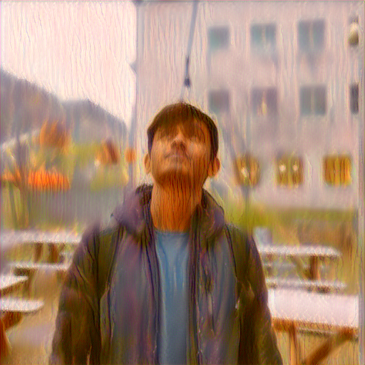
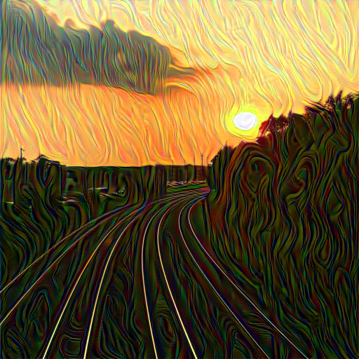

# Neural Style Transfer Application

Flask Application for Neural Style Transfer Between two Images with PyTorch

## Running with Docker

```bash
docker build -t nstapp .
docker run -p 8000:8000 nstapp
```

then navigate to http://localhost:8000/ for the running app

## Installation

After downloading files:

```bash
pip install -r requirements.txt
python app.py
```

## Example Images

Some Images produced with the model






